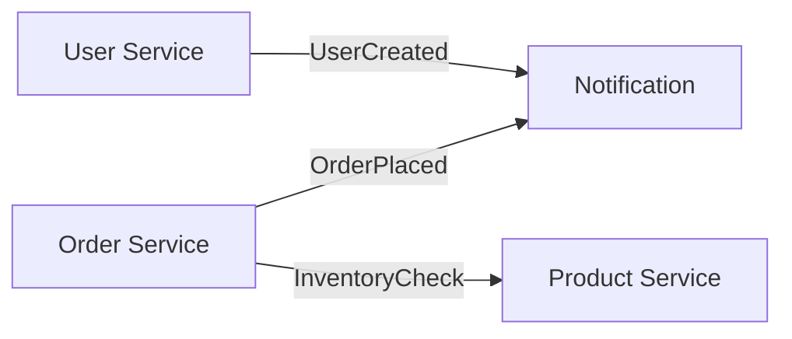

# 🚀 TypeScript Microservices Architecture

Enterprise-grade microservices template built with TypeScript, Node.js, Express, and modern tooling. Features clean architecture, event-driven communication, and full observability.


## ✨ Core Features

- 💪 100% TypeScript with strict mode
- 🎯 Domain-Driven Design (DDD) principles
- 🔄 Event-driven architecture using RabbitMQ
- 🔍 OpenAPI/Swagger documentation
- 📊 Structured logging with ******
- 🧪 Comprehensive testing setup
- 🔒 Built-in security features
- 📈 Prometheus metrics & tracing

## 🏗 Project Structure

```
├── services/
│   ├── user-service/
│   ├── product-service/
│   ├── order-service/
│   └── notification-service/
├── libs/
│   ├── common/
│   ├── event-bus/
│   └── testing/
└── tools/
    ├── generators/
    └── scripts/
```

Each service follows clean architecture:
```
service/
├── src/
│   ├── domain/          # Business entities & logic
│   ├── application/     # Use cases & ports
│   ├── infrastructure/  # External implementations
│   ├── interfaces/      # Controllers & DTOs
│   └── main.ts         # Service entry point
├── test/
│   ├── unit/
│   ├── integration/
│   └── e2e/
└── package.json
```

## 🛠 Tech Stack

- **Runtime:** Node.js 20+
- **Language:** TypeScript 5
- **Framework:** Express with routing-controllers
- **Database:** TypeORM with PostgreSQL
- **Messaging:** RabbitMQ with TypeScript events
- **Validation:** class-validator & class-transformer
- **Testing:** Jest, Supertest
- **Documentation:** TypeDoc, Swagger
- **Monitoring:** Prometheus, OpenTelemetry
- **DevOps:** Docker, Docker Compose

## 🚀 Quick Start

1. **Clone and Install**
```bash
git clone https://github.com/your-username/ts-microservices.git
cd ts-microservices
npm install
```

2. **Environment Setup**
```bash
cp .env.example .env
# Configure your environment variables
```

3. **Start Development Environment**
```bash
# Start infrastructure
docker-compose up -d

# Start all services in development mode
npm run dev
```

## 📦 Available Services

### User Service (Port 3001)
```typescript
// Example user entity
interface User {
  id: string;
  email: string;
  profile: UserProfile;
  roles: UserRole[];
}
```

### Product Service (Port 3002)
```typescript
// Example product entity
interface Product {
  id: string;
  name: string;
  price: Money;
  inventory: Inventory;
}
```

### Order Service (Port 3003)
```typescript
// Example order entity
interface Order {
  id: string;
  userId: string;
  items: OrderItem[];
  status: OrderStatus;
}
```

## 🔧 Development

### Service Generation
```bash
npm run generate:service -- --name=new-service
```

### Type Safety
```bash
# Run type checking
npm run type-check

# Generate types from OpenAPI
npm run generate:types
```

### Testing
```bash
# Unit tests
npm run test

# Integration tests
npm run test:integration

# E2E tests
npm run test:e2e

# Test coverage
npm run test:coverage
```

## 📊 Event Flow



## 🔒 Security Features

- JWT authentication
- Request validation
- Rate limiting
- CORS configuration
- Helmet security headers
- SQL injection prevention

## 📈 Monitoring

### Metrics
```typescript
// Example metric collection
@Metrics()
class OrderService {
  @Counter('orders_total')
  async createOrder() {
    // Implementation
  }
}
```

### Logging
```typescript
// Structured logging
logger.info('Order created', {
  orderId: order.id,
  userId: order.userId,
  amount: order.total
});
```

## 🚢 Deployment

### Docker
```bash
# Build all services
docker-compose build

# Run production mode
docker-compose -f docker-compose.prod.yml up -d
```

### Kubernetes
```bash
# Apply configurations
kubectl apply -f k8s/

# Verify deployment
kubectl get pods
```

## 👥 Contributing

1. Fork the repository
2. Create your feature branch (`git checkout -b feature/amazing`)
3. Run tests (`npm run test`)
4. Commit changes (`git commit -m 'Add feature'`)
5. Push to branch (`git push origin feature/amazing`)
6. Open a Pull Request

### Coding Standards

```json
{
  "extends": [
    "airbnb-typescript/base",
    "plugin:@typescript-eslint/recommended",
    "prettier"
  ],
  "rules": {
    "@typescript-eslint/explicit-function-return-type": "error",
    "@typescript-eslint/no-explicit-any": "error"
  }
}
```

## 📚 API Documentation

- REST API docs: `http://localhost:3000/api-docs`
- TypeDoc: `http://localhost:3000/docs`

## 📄 License

MIT © [Your Name]

---
# Vijaa Frontend Monorepo

# Next.js + React + React Native

## You have to only use Yarn don't use npm

Install Dependencies:

```sh
$ yarn install 
```

If you want to install package from npm:

```sh
$ yarn workspace @frontend/web add <package name>
```

# Next.js Web

Run Web Next.js:

```sh
$ yarn web
```

# Storybook

To run stories of your storybook open a new termianl and run:

```sh
$ yarn web:storybook
```

# Run Test Cases

To run Cypress test cases for web react components(headless - tests will run in terminal without opening the browser)

```sh
$ yarn web:test
```


To run Cypress test cases for web react components(head - tests will run in browser)

```sh
$ yarn web:test:head
```


Build Web:

If you only want to run a single test then you can use this command

```sh
$ yarn workspace @frontend/web run cypress run-ct --spec ./src/components/<path-to-your-test-file>
```

```sh
$ yarn web:build
```

Deploy Web:

```sh
$ yarn web:deploy
```

# React Native

Install Pod Dependencies (Only on Mac OS):

```sh
$ yarn pod:install (if yarn didn't work try npm install pod-install)
```

Start metro server:

```sh
$ yarn mobile
```

Run android:

```sh
$ yarn android
```

Run ios:

```sh
$ yarn ios
```

# Android Build

Clean the build folders:

```sh
$ yarn android:clean
```

Create build:

```sh
$ yarn android:build
```

# iOS Build

Open project in xcode:

```sh
$ yarn xcode
```
>>>>>>> 2423047 (Initial commit)
